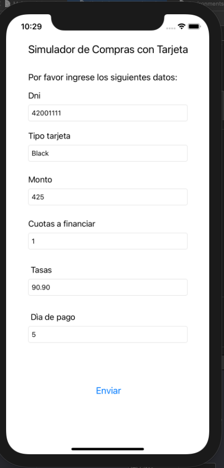
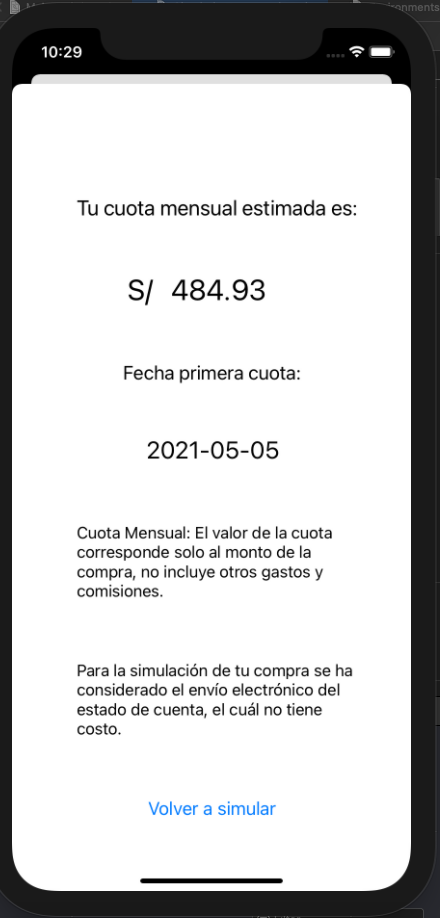

# Simulador de compras: Reto Bootcamp BCP

Este repositorio hace referencia a un simulador de compras con tarjeta creada en el Bootcamp BCP. Los usuarios acceden a la aplicación e ingresan algunos datos que serviran para simular las cuotas, moneda día de pago.







[Accede a los detalles del reto aquí.](https://docs.google.com/document/d/11cFbKphO9H8RYoHR4xJR2j5jkJzgGSEYxN2jkWGyy3c/edit)

# Setting up

## Requerimientos

- **XCode 12:** Requerida para compilar el proyecto https://developer.apple.com/xcode/
- **CocoaPods:** CocoaPods es un manager de dependecias para Switft y Objective-C https://cocoapods.org
- **Postman:** Postman es una plataforma de colaboración para el desarrollo de APIs https://www.postman.com/

## Setup Steps

Antes de empezar, asegúrate de tener instalado los requerimientos

# Instalación

Clona el repositorio en tu máquina

```bash
$ git clone https://github.com/nickthewitcher/simuladortarjetas.git
$ cd simuladortarjetas
```

# Uso


#### 1. Instalación de dependencias

```bash
$ pod install
```

#### 2. Configura las variables de entorno
 Edita el archivo Environments con los url de la API que desees utilizar.

#### 3. Ejecutar el proyecto con XCode 12
  Ahora ya puedes ejecutar el proyecto en el simulador de XCode 12